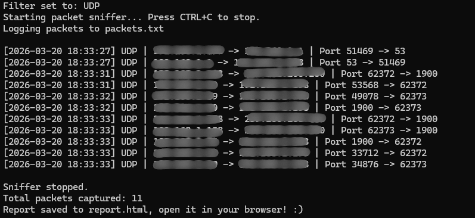

# 🔍 Packet Sniffer

A command-line network packet sniffer built with Python and Scapy that captures
live network traffic, filters by protocol, logs packets to a file, and generates
a formatted HTML report on exit.

> ⚠️ **Disclaimer:** This tool is intended for educational purposes only.
> Only use it on networks you own or have explicit permission to monitor.

---

## 📸 Screenshots

### Filter Selection


### Live Packet Capture


### Exit Summary


### HTML Report


---

## ✨ Features

- 📡 Captures live TCP, UDP, and ICMP network traffic
- 🔎 Filter packets by protocol at startup
- 📁 Logs all captured packets to `packets.log`
- 📊 Generates a color-coded HTML report on exit
- 🧮 Displays total packet count when stopped

---

## 🛠️ Tech Stack

- Python 3.14
- [Scapy 2.7.0](https://scapy.net/) — packet capture and analysis
- [Npcap](https://npcap.com/) — Windows packet capture driver
- HTML/CSS — report generation

---

## ⚙️ Installation

### Prerequisites
- Python 3.x
- Npcap (Windows only) — [Download here](https://npcap.com/#download)
  - Check **"Install Npcap in WinPcap API-compatible mode"** during install

### Steps

1. Clone the repository
```bash
   git clone https://github.com/yourusername/packet-sniffer.git
   cd packet-sniffer
```

2. Install dependencies
```bash
   python -m pip install scapy
```

3. Run as Administrator
```bash
   python sniffer.py
```

---

## 🚀 Usage

1. Run the script as Administrator (required for packet capture on Windows)
2. Select a protocol filter from the menu:
```
   Select a filter:
     1. ALL
     2. TCP
     3. UDP
     4. ICMP
```
3. Watch packets stream in the terminal in real time
4. Press CTRL+C to stop, the tool will display a summary and generate report.html
5. Open report.html in your browser to view the full report

---

## 📂 Project Structure
```
packet-sniffer/
├── sniffer.py       # Main script
├── packets.log      # Auto-generated packet log
├── report.html      # Auto-generated HTML report
```

---

## 📖 What I Learned

- How network packets are structured across layers (IP, TCP, UDP, ICMP)
- Using Scapy for real-time packet capture and protocol parsing
- Applying filtering logic to isolate specific types of network traffic
- Generating dynamic HTML reports from captured data
- Running privileged network operations on Windows with Npcap

---

## 👤 Author

**Dazza**  
Computer Science Graduate — Cybersecurity & Software Engineering  
